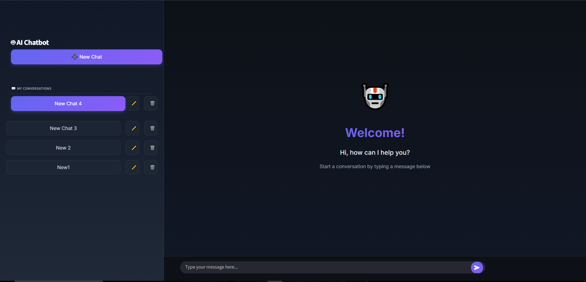
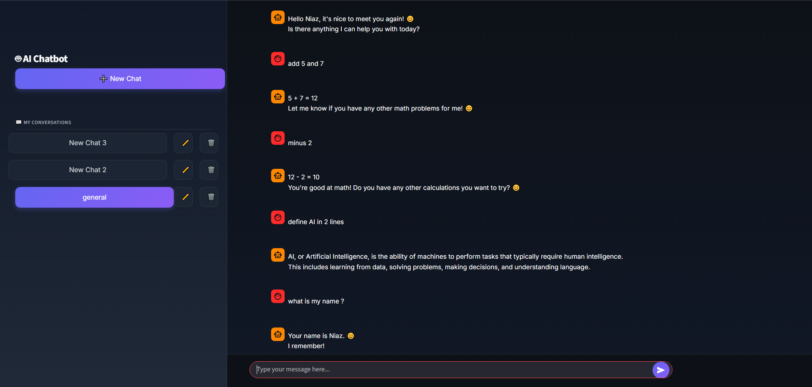

# AI Chatbot 🤖

A modern, feature-rich chatbot application built with Streamlit and LangGraph, featuring persistent conversation history and a dark-themed UI.




## Features

✨ **Multi-Conversation Support**
- Create and manage multiple chat threads
- Persistent conversation history using LangGraph checkpointing
- Easy switching between different conversations

🎨 **Modern UI/UX**
- Sleek dark-themed interface with gradient accents
- Responsive design that works on desktop, tablet, and mobile
- Smooth animations and transitions
- Custom-styled chat bubbles and sidebar

💬 **Chat Management**
- Rename conversations with inline editing
- Delete individual chat threads
- Active conversation highlighting
- Auto-generated conversation names

🔧 **Technical Features**
- Powered by Groq's Gemma2-9b-it model
- State management using LangGraph
- Streaming responses for real-time interaction
- In-memory conversation persistence

## Installation

1. **Clone the repository**
```bash
git clone https://github.com/yourusername/ai-chatbot.git
cd ai-chatbot
```

2. **Install dependencies**
```bash
pip install -r requirements.txt
```

3. **Set up environment variables**

Create a `.env` file in the root directory:
```env
GROQ_API_KEY=your_groq_api_key_here
```

Get your Groq API key from [console.groq.com](https://console.groq.com)

## Project Structure

```
ai-chatbot/
├── frontend.py          # Streamlit UI implementation
├── backend.py           # LangGraph chatbot logic
├── demo.PNG            # Welcome screen screenshot
├── chat_demo.PNG       # Chat conversation screenshot
└── requirements.txt    # Python dependencies
```

## Usage

Run the application:
```bash
streamlit run frontend.py
```

The app will open in your default browser at `http://localhost:8501`

### Creating a New Chat
1. Click the **"➕ New Chat"** button in the sidebar
2. Start typing your message in the input box
3. Press Enter or click the send button

### Managing Conversations
- **Switch Chat**: Click on any conversation in the sidebar
- **Rename Chat**: double Click the edit (✏️) icon next to a conversation
- **Delete Chat**: double Click the delete (🗑️) icon next to a conversation

## Configuration

### Backend Configuration (`backend.py`)

The chatbot uses Groq's Gemma2-9b-it model. You can modify the model parameters:

```python
llm = ChatGroq(
    model="gemma2-9b-it",      # Model name
    temperature=0,              # Creativity (0-1)
    max_tokens=None,           # Max response length
    timeout=None,              # Request timeout
    max_retries=2,             # Retry attempts
)
```

### UI Customization (`frontend.py`)

The app uses custom CSS for styling. Key customization points:
- Color scheme: Modify gradient colors in the CSS section
- Chat bubble styles: Adjust `.stChatMessage` classes
- Sidebar appearance: Modify `[data-testid="stSidebar"]` styles


## Dependencies

- **Streamlit**: Web application framework
- **LangGraph**: State management for conversational AI
- **LangChain**: LLM orchestration framework
- **Groq**: Fast AI inference platform
- **Python-dotenv**: Environment variable management

## Features in Detail

### State Management
Uses LangGraph's `StateGraph` to maintain conversation context across messages:
- Each conversation has a unique thread ID
- Messages are stored with InMemorySaver checkpointing
- Full conversation history is maintained per thread

### Streaming Responses
Real-time message streaming provides a better user experience:
```python
def ai_only_stream():
    for message_chunk, metadata in chatbot.stream(...):
        if isinstance(message_chunk, AIMessage):
            yield message_chunk.content
```

### Responsive Design
The UI adapts to different screen sizes:
- Desktop: Wide layout with visible sidebar
- Tablet: Optimized spacing and font sizes
- Mobile: Compact view with touch-friendly controls

## Troubleshooting

**Issue**: API key not found
- **Solution**: Ensure `.env` file exists with valid `GROQ_API_KEY`

**Issue**: Module not found errors
- **Solution**: Run `pip install -r requirements.txt`

**Issue**: Sidebar not visible
- **Solution**: Click the toggle button in the top-left corner

**Issue**: Slow responses
- **Solution**: Check your internet connection or try a different Groq model

## Contributing

Contributions are welcome! Please feel free to submit a Pull Request.

1. Fork the repository
2. Create your feature branch (`git checkout -b feature/AmazingFeature`)
3. Commit your changes (`git commit -m 'Add some AmazingFeature'`)
4. Push to the branch (`git push origin feature/AmazingFeature`)
5. Open a Pull Request


## Acknowledgments

- Built with [Streamlit](https://streamlit.io/)
- Powered by [Groq](https://groq.com/)
- State management by [LangGraph](https://github.com/langchain-ai/langgraph)
- LLM orchestration by [LangChain](https://www.langchain.com/)

## Support

For issues, questions, or contributions, please open an issue on GitHub.

---
